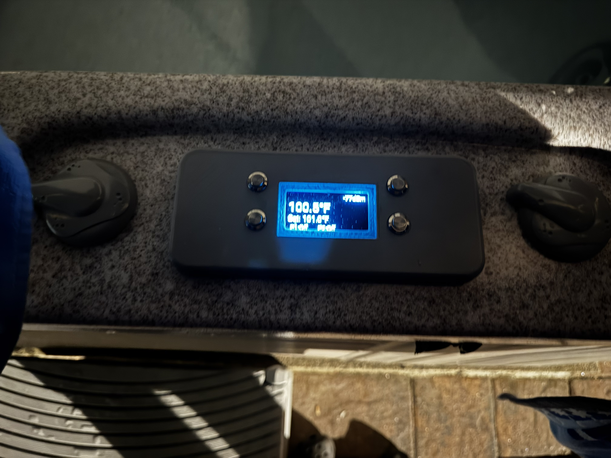
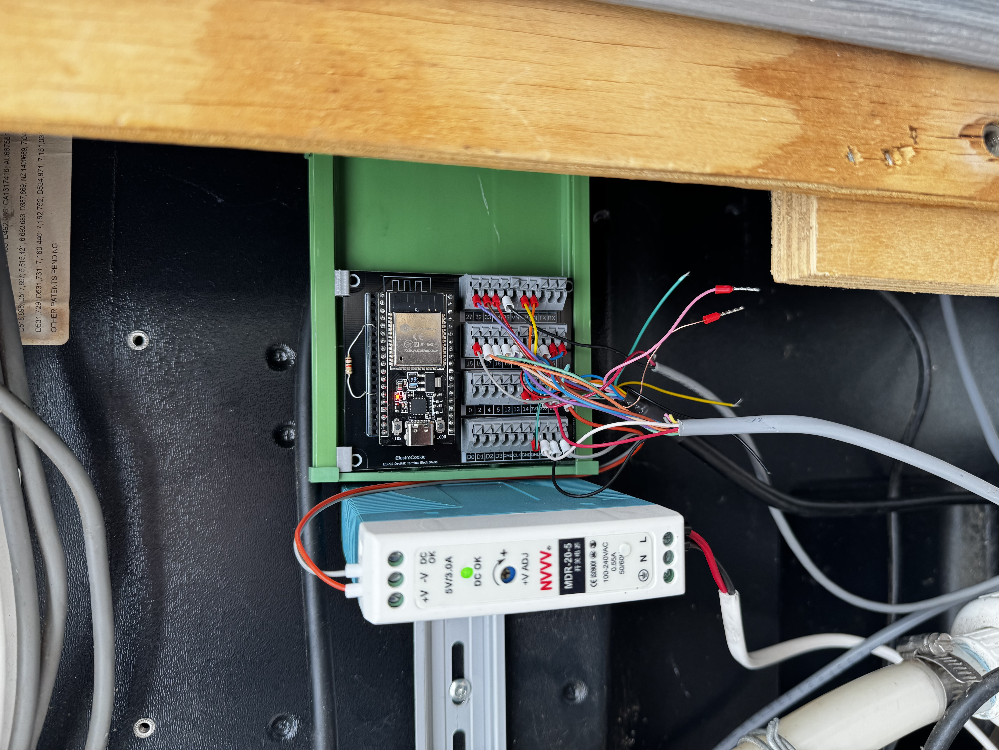

# Apollo 11 Spa Controller — ESPHome HMI Replacement

**Replaces the dead OEM controller/HMI on an Apollo 11 spa pack with an ESP32 running ESPHome, using a Home Assistant dashboard and a local OLED faceplate as the user interfaces.**

The Apollo 11 spa pack's original HMI/controller board is dead. The relay box and all power-stage hardware — including the heater, pumps, relays, and manifold-mounted temperature sensors — are still fully functional. This project plugs an ESP32 into the relay box's DB15 port via a terminal adapter, replacing the OEM interface entirely. A Home Assistant dashboard provides thermostat control, pump management, filter scheduling, and real-time temperature monitoring. A physical OLED faceplate at the spa provides local control without requiring a phone or HA connection.



---

## Architecture

```
┌─────────────────────┐  DB15 Terminal   ┌──────────────────────────┐
│  ESP-32 DevKit C    │    Adapter       │  Apollo 11 Relay Box     │
│                     ├──────────────────┤                          │
│  ESPHome firmware   │ Logic signals    │  Internal relays for:    │
│  WiFi → Home Asst.  │ (3.3V)           │  - Heater coil           │
│                     │ OEM NTC sensor   │  - Hi-Limit 1 & 2       │
│  Faceplate:         │ inputs           │  - Pump 1 (Low/High)    │
│  2.42" OLED + 4×   │                  │  - Pump 2               │
│  SS push-buttons    │ External sensor  │  - Circulator            │
│                     │ wire (not DB15)  │                          │
│  External sensor:   │                  │  OEM sensors (on heater):│
│  Spa body NTC ──────┤                  │  - Inlet NTC (DB15/5)   │
│                     │                  │  - Outlet NTC (DB15/6)  │
│  Power: DIN rail    │                  │                          │
│  3.3V supply        │                  │                          │
└─────────────────────┘                  └──────────────────────────┘
```

**The ESP32 does not drive relays directly.** It sends logic-level signals through the DB15 connector to the Apollo 11 relay box, which handles all power switching.

The **inlet and outlet temperature sensors are OEM** — they are built into the Apollo 11 relay box and physically attached to the heater manifold. The **spa body temperature sensor is external**, added as part of this project to measure the actual spa water temperature for thermostat control.

---

## Hardware

| Component | Detail |
|---|---|
| Spa Pack | Apollo 11 (OEM relay box intact, OEM HMI dead) |
| MCU | ESP-32 DevKit C |
| Display | 2.42" SSD1306 128×64 OLED (I²C, 0x3C) |
| Buttons | 4× ½" waterproof stainless steel momentary push-buttons (active LOW) |
| Power | DIN rail mount 3.3 V supply (independent of relay box) |
| Connection | DB15 terminal adapter → Apollo 11 relay box DB15 port |
| Framework | ESPHome (ESP-IDF) |
| OEM Sensors | Inlet & outlet NTCs (built into relay box, on heater manifold) |
| External Sensor | Spa body NTC (added, separate wiring loom, measures actual spa water temp) |
| Integration | Home Assistant via encrypted native API |



### DB15 Pinout

| DB15 Pin | Wire | GPIO | ESPHome ID | Function |
|----------|------|------|------------|----------|
| Pin 1 | 1 | 3.3V | — | 3.3 V from relay box (unused) |
| Pin 2 | 3 | GPIO32 | `r_HiLim_1` | Heater hi-limit relay 1 |
| Pin 3 | 5 | GPIO33 | `r_HiLim_2` | Heater hi-limit relay 2 |
| Pin 4 | 7 | GPIO25 | `r_Heater` | Heater coil relay |
| Pin 5 | 9 | GPIO36 | `inlet_sensor` | Inlet water temp — OEM (ADC) |
| Pin 6 | 11 | GPIO39 | `outlet_sensor` | Outlet water temp — OEM (ADC) |
| Pin 7 | 13 | 3.3V | — | 3.3 V MCU supply aux (unused) |
| Pin 8 | 15 | — | — | Unknown (unconnected) |
| Pin 9 | 2 | 0V | — | Isolated 0 V (not grounded) |
| Pin 10 | 4 | GPIO26 | `r_P1_low` | Pump 1 — low speed |
| Pin 11 | 6 | GPIO27 | `r_P1_high` | Pump 1 — high speed |
| Pin 12 | 8 | — | — | Light relay (unconnected) |
| Pin 13 | 10 | GPIO14 | `r_Circ` | Circulator pump |
| Pin 14 | 12 | GPIO21 | [reserved] | Pump 2 Low (future) |
| Pin 15 | 14 | GPIO13 | `r_P2_high` | Pump 2 — high speed |

The relay box energises its internal relays when the corresponding DB15 input is driven HIGH (3.3 V). All ESP32 GPIOs are configured as push-pull outputs with `inverted: false`.

> **Note:** Pump 2 LOW speed is NOT supported by the current motor/pump. Pin 14 / GPIO21 is reserved for future P2 Low support. All filter cycle and manual P2 logic uses P2 HIGH only.

### Temperature Sensors

| Sensor | GPIO | Divider Config | Ref Resistor | Location | Origin |
|--------|------|----------------|--------------|----------|--------|
| Inlet | 36 | DOWNSTREAM | 9.0 kΩ | Heater manifold inlet | **OEM** (relay box) |
| Outlet | 39 | DOWNSTREAM | 9.0 kΩ | Heater manifold outlet | **OEM** (relay box) |
| Spa | 34 | UPSTREAM | 10.0 kΩ | Spa body water | **External** (separate loom) |

The inlet and outlet NTCs are part of the Apollo 11 relay box hardware, physically mounted on the heater element/manifold. Their signals pass through the DB15 connector. The spa body sensor is a separate NTC added to this project, wired directly to the ESP32 on a separate loom (NOT through the DB15), to provide an accurate reading of the actual spa water temperature for thermostat control.

ADC pins (GPIO34, 36, 39) are input-only on the ESP32 and have no internal pull-up capability.

All three use the same NTC calibration: `10.0 kΩ → 25°C`, `32.665 kΩ → 0°C`, `6.530 kΩ → 35°C`.

Filter chain: **median** (window 5) → **exponential moving average** (α = 0.15).

The spa sensor includes a user-adjustable calibration offset (`Spa Temp Offset` in HA) applied via a template sensor. The raw and corrected readings are both exposed to HA.

---

## Faceplate — OLED Display + Push-Buttons

The faceplate is a local HMI panel mounted at the spa. It provides basic control and monitoring WITHOUT requiring a phone, tablet, or Home Assistant connection. All faceplate GPIOs are on the right side of the ESP32 DevKit C, physically separated from the DB15 signals.

### Faceplate GPIO Map

| GPIO | ESPHome ID | Type | Function |
|------|------------|------|----------|
| GPIO22 | (I²C SDA) | I²C | SSD1306 OLED display data |
| GPIO23 | (I²C SCL) | I²C | SSD1306 OLED display clock |
| GPIO19 | `btn_p1` | Input PU | Pump 1 cycle button |
| GPIO18 | `btn_p2` | Input PU | Pump 2 cycle button |
| GPIO16 | `btn_temp_up` | Input PU | Temperature setpoint UP |
| GPIO17 | `btn_temp_down` | Input PU | Temperature setpoint DOWN |

> **Note:** GPIO16 is a strapping pin — internal pull-up to HIGH at boot is the correct/safe default (button not pressed = HIGH). ✓

### Button Behaviour

**P1 BUTTON (GPIO19) — three states:**

```
┌─────┐  press  ┌─────┐  press  ┌──────┐  press  ┌─────┐
│ OFF │ ──────→ │ LOW │ ──────→ │ HIGH │ ──────→ │ OFF │
└─────┘         └─────┘         └──────┘         └─────┘
```

- Off → press → Pump 1 Low ON (auto-off timer starts). Clears lockout if active.
- Low → press → Pump 1 High ON (interlock kills Low, timer restarts). Clears lockout if active.
- High → press → Pump 1 OFF (restores Low if virtual heater active). Activates pump safety lockout.

**P2 BUTTON (GPIO18) — two states** (P2 Low not supported):

```
┌─────┐  press  ┌──────┐  press  ┌─────┐
│ OFF │ ──────→ │ HIGH │ ──────→ │ OFF │
└─────┘         └──────┘         └─────┘
```

- Off → press → Pump 2 High ON (auto-off timer starts). Clears lockout if active.
- High → press → Pump 2 OFF (blocked if filter cycle active). Activates pump safety lockout.

**TEMP UP (GPIO16):** Each press increases the thermostat setpoint by +1°F (+0.5556°C). Clamped at 40.6°C (105°F) maximum.

**TEMP DOWN (GPIO17):** Each press decreases the thermostat setpoint by −1°F (−0.5556°C). Clamped at 5.0°C (41°F) minimum.

**HEAT MODE TOGGLE (GPIO16 + GPIO17):** Hold both Temp Up and Temp Down simultaneously for 3 seconds. Toggles thermostat between HEAT and OFF modes. Display updates immediately to show "Heat: OFF" or the setpoint.

**CONFIG MODE (GPIO19 + GPIO17):** Hold P1 + Temp Down simultaneously for 10 seconds. Triggers `enter_config_mode` script (placeholder for future use).

All faceplate button presses trigger an immediate OLED display refresh via the `refresh_display` script.

### OLED Display Layout

```
┌──────────────────────────────────┐
│ LOCKOUT            -72 dBm       │ ← lbl_lockout (left) + lbl_wifi (right)
│  101.3°F                         │ ← lbl_temp_current (font_temp 20px)
│  Set: 102.0°F                    │ ← lbl_temp_setpoint (font_info 12px)
│  P1:Lo    P2:Off                 │ ← lbl_p1 + lbl_p2 (font_label 10px)
└──────────────────────────────────┘
```

Label updates run on a 5-second conditional interval (only redraws when values change) plus instant refresh on any faceplate button press:

| Label | Content |
|-------|---------|
| `lbl_lockout` | "LOCKOUT" when pump safety lockout is active, blank otherwise |
| `lbl_wifi` | WiFi RSSI in dBm (top-right) |
| `lbl_temp_current` | Current spa_temp reading in °F (or "--.-°F" if NaN) |
| `lbl_temp_setpoint` | Thermostat target in °F ("Set: xx.x°F"), or "Heat: OFF" when thermostat is off |
| `lbl_p1` | "P1:Off", "P1:Lo", or "P1:Hi" |
| `lbl_p2` | "P2:Off" or "P2:Hi" |

---

## Heater Safety Architecture

The heater circuit inside the Apollo 11 relay box is a **three-relay series chain**:

```
[Hi-Limit 1] ──── [Hi-Limit 2] ──── [Heater Coil Relay]
  DB15/2             DB15/3             DB15/4
  GPIO32             GPIO33             GPIO25
```

**All three relays must be energised** for current to flow through the heating element. Opening any single relay breaks the circuit. This provides multiple independent safety layers:

| Layer | Mechanism | Detail |
|-------|-----------|--------|
| **1 — Runtime gate** | Software | Thermostat only fires the heater when `startup_test_complete && !high_temp_alarm && !boot_failed && !pump_safety_lockout` |
| **2 — Over-temp alarm** | Software | Any sensor > 42°C → heater circuit killed, pumps stay running for cooling, manual reset required |
| **3 — Hardware cutout** | Verified on boot | Startup self-test independently verifies each hi-limit relay can break the circuit |

### Virtual Heater

The `Virtual Heater` template switch is the **only approved way** to turn the heater on. It enforces the correct energisation/de-energisation sequence:

- **ON:** HL1 → HL2 → 500 ms → Pump 1 Low → 500 ms → Heater relay
- **OFF:** Heater relay → 500 ms → Pump 1 Low off → HL2 off → HL1 off

---

## Startup Self-Test

Runs automatically on every boot. The system **will not heat** until all tests pass. The test exploits the physics of stagnant water — with no flow, even a short heater pulse produces a large, easily-detected temperature rise on the OEM outlet NTC (which is physically attached to the heater element inside the relay box).

> **Why not measure inlet-to-outlet delta with flow?** The ADC/NTC sensor chain lacks the resolution to reliably detect the small temperature differential across the heater manifold when water is moving. Stagnant water eliminates this problem entirely.

### Test Sequence (~2 minutes)

#### Sensor Validation (~12s)

Primes the median/EMA filter chains with 5 rounds of manual reads. Verifies inlet and outlet are within the −10°C to 100°C sane range.

#### Step 1 — Hi-Limit 1 ON Only (5s)

- Circuit incomplete (HL2 and Heater relay both OFF)
- ✅ Verify **no temperature change**
- Proves HL1 alone cannot fire the heater

#### Step 2 — Both Hi-Limits ON, Heater OFF (5s)

- Circuit still incomplete (Heater relay OFF)
- ✅ Verify **no temperature change**
- Proves hi-limits alone cannot fire the heater

#### Step 3 — Full Circuit, Heater ON (pulse)

- All three relays energised via DB15
- Heater fires into stagnant water for `heater_pulse_ms` (default 5000 ms, tunable from HA, hard-clamped to 6000 ms max)
- ✅ Verify **temperature rise ≥ 0.5°C** on OEM outlet sensor
- Uses "check once, retry once" — if the first read window doesn't show enough rise, a second window is attempted
- 50°C safety abort at each window boundary
- **Heater relay stays ON** for the break tests

#### Step 4 — Hi-Limit 1 Break Test (~35s)

- Heater relay **still ON**. Hi-Limit 1 **opened**
- **Pump 1 High runs 15s** — flushes cool spa water through the manifold, clearing all residual heat from Step 3
- Pump stops. Water is stagnant and cool. Heater relay still energised
- Wait 10s — if HL1 is not breaking the circuit, the stagnant water heats up immediately
- ✅ Verify **no rise > 0.5°C**
- The pump flush also implicitly verifies water flow

#### Step 5 — Hi-Limit 2 Break Test (~35s)

- Same as Step 4 but for Hi-Limit 2
- **Safe relay transition:** HL2 opens first (while HL1 is still open), then HL1 closes — the circuit is **never complete** during the swap
- Pump flush 15s → stagnant 10s → verify no rise

#### Completion

All outputs OFF → `startup_test_complete = true` → circulator pump starts → HA notification sent.

#### Abort

Any failure → all outputs killed → `boot_failed = true` → HA notification. Use the **"Retry Startup Test"** button in HA after investigating.

---

## Pump Safety Lockout

When any pump is manually turned OFF — via faceplate button, HA dashboard button, or auto-off timer expiry — a configurable lockout period activates:

- Thermostat heating is **BLOCKED** (`virtual_heater` will not start)
- Automatic filter cycles are **BLOCKED**
- Active virtual heater is **immediately shut down**
- Active filter cycle is **immediately stopped**
- "LOCKOUT" indicator appears on the OLED display (top-left)

This prevents automation from immediately re-starting equipment that a user just turned off.

**Lockout is cleared by:**

- **Timer expiry** — default 10 minutes, configurable in HA via "Pump Safety Lockout (minutes)"
- **Manual pump ON** — turning any pump back on from faceplate or HA clears lockout immediately
- **Cancel button** — "Cancel Pump Lockout" button in HA

The lockout script uses `mode: restart`, so successive pump-off events reset the countdown from the most recent event.

---

## Runtime Operation

### Thermostat

ESPHome thermostat climate entity (`Spa Temp Controller`) using the calibrated external `spa_temp` sensor. Controls the heater via `virtual_heater` on/off with a **quadruple safety gate**:

`startup_test_complete && !high_temp_alarm && !boot_failed && !pump_safety_lockout`

| Parameter | Value |
|-----------|-------|
| Min heating off time | 60s |
| Min heating run time | 3s |
| Min idle time | 240s |
| Temperature range | 5°C – 40.6°C (41°F – 105°F) |

The thermostat mode (Heat / Off) can be toggled from the faceplate by holding both Temp Up and Temp Down for 3 seconds.

### High-Temperature Alarm

Triggers if **any** sensor (OEM inlet, OEM outlet, or external spa) exceeds 42°C:

- Heater circuit killed (all 3 relay signals dropped)
- Pumps **stay running** for circulation/cooling
- Virtual heater state updated via `publish_state()` (avoids triggering `turn_off_action`, which would kill the pump)
- Manual reset required via **"Reset Hi-Limit"** button in HA

### Filter Cycle

Automatic periodic water filtration using Pump 2 High. Blocked during pump safety lockout.

| Parameter | Default | HA Adjustable |
|-----------|---------|---------------|
| Interval | 120 min (2 hr) | ✅ |
| Runtime | 10 min | ✅ |

Manual trigger available via **"Run Filter Cycle"** button. Timer text sensors display remaining cycle time and next scheduled run in `hh:mm` format.

> **Note:** P2 Low is not supported — filter cycle uses P2 High only.

### Sensor Polling

During boot test: sensors polled manually by test script only (`boot_testing_active` suppresses the interval timer). After boot: 5-second interval polls inlet, outlet, and spa sensors.

---

## Home Assistant Entities

### Switches

| Entity | Function |
|--------|----------|
| Circ Pump | Circulator (visible toggle, runs continuously after boot) |
| Virtual Heater | Safe heater on/off abstraction |

> **Note:** Pump 1 (Low/High) and Pump 2 (High) GPIO switches are `internal: true` — not directly visible in HA. Users control pumps via HA Buttons (toggle with auto-off) or faceplate buttons.

### Sensors

| Entity | Detail |
|--------|--------|
| Inlet Temperature | OEM heater manifold inlet (°C) |
| Outlet Temperature | OEM heater manifold outlet (°C) |
| Spa Temperature Raw | Uncorrected external spa body NTC reading (°C) |
| Spa Temperature | Corrected external spa reading (raw + offset) (°C) |
| Inlet/Outlet Voltage | Raw ADC readings (debug) |
| Inlet/Outlet Resistance | Calculated resistance (debug) |

### Binary Sensors

| Entity | Detail |
|--------|--------|
| Startup Test Complete | `true` after all tests pass |
| High Temperature Alarm | `true` when any sensor > 42°C |
| Hi-Limit Relay Triggered | `true` when alarm has fired (latched until reset) |
| Boot Failed | `true` if startup test failed |
| Pump 1 Low Running | `true` when P1 Low switch is on |
| Pump 1 High Running | `true` when P1 High switch is on |
| Pump 2 High Running | `true` when P2 High switch is on |
| Pump Safety Lockout Active | `true` during pump safety lockout period |

### Buttons

| Entity | Function |
|--------|----------|
| Pump 1 Low | Toggle P1 Low on/off (auto-off timer, heater flow guard) |
| Pump 1 High (Jets) | Toggle P1 High on/off (auto-off timer, restores P1 Low for heater) |
| Pump 2 High | Toggle P2 High on/off (auto-off timer, filter guard) |
| Reset Hi-Limit | Clears alarm flags, allows heating to resume |
| Retry Startup Test | Re-runs the full startup test sequence |
| Run Filter Cycle | Manually triggers a filter cycle |
| Cancel Pump Lockout | Ends pump safety lockout early, re-enables automation |

### Number Inputs (all numeric entry boxes)

| Entity | Range | Default | Purpose |
|--------|-------|---------|---------|
| Heater Test Pulse (ms) | 500–6000 | 5000 | Startup test heater-on duration |
| Spa Temp Offset (°C) | −5.0 to +5.0 | 0.0 | External spa NTC calibration correction |
| Pump Auto-Off Timer (minutes) | 5–120 | 30 | Auto-off countdown for manually activated pumps |
| Filter Cycle Interval (minutes) | 60–1440 | 120 | Time between automatic filter runs |
| Filter Cycle Runtime (minutes) | 1–120 | 10 | Duration of each filter run |
| Pump Safety Lockout (minutes) | 1–60 | 10 | Lockout duration after manual pump off |

### Text Sensors

| Entity | Detail |
|--------|--------|
| Filter Cycle Remaining | `hh:mm` countdown during active cycle |
| Next Filter Cycle | `hh:mm` until next scheduled cycle |

### Climate

| Entity | Detail |
|--------|--------|
| Spa Temp Controller | Thermostat (heat mode, toggleable to off via faceplate or HA) |

---

## Globals Reference

| ID | Type | Persists | Purpose |
|----|------|----------|---------|
| `startup_test_complete` | bool | no | Gate for thermostat heating |
| `high_temp_alarm` | bool | no | Over-temperature flag |
| `hi_limit_triggered` | bool | no | Latched alarm flag |
| `boot_testing_active` | bool | no | Suppresses interval sensor polling |
| `boot_failed` | bool | no | Blocks all heating |
| `heater_temp_baseline_inlet` | float | no | Test reference temperature (OEM sensor) |
| `heater_temp_baseline_outlet` | float | no | Test reference temperature (OEM sensor) |
| `heater_pulse_ms` | uint32 | yes | Startup test pulse duration |
| `spa_temp_offset` | float | yes | External spa NTC calibration offset |
| `temp_deadband` | float | no | Rise/fall detection threshold |
| `pump_auto_off_minutes` | uint32 | yes | Manual pump auto-off timeout |
| `pump_safety_lockout` | bool | no | Blocks automation during lockout |
| `pump_lockout_minutes` | uint32 | yes | Lockout duration (minutes) |
| `filter_last_run_time` | uint32 | yes | `millis()` timestamp of last filter run |
| `filter_cycle_enabled` | bool | yes | Automatic filter on/off |
| `filter_interval_minutes` | uint32 | yes | Minutes between filter cycles |
| `filter_runtime_minutes` | uint32 | yes | Minutes per filter cycle |
| `filter_running` | bool | no | Filter cycle currently in progress |
| `config_mode` | bool | no | Faceplate config mode flag |
| `config_hold_start` | uint32 | no | Config combo hold timer |
| `heat_toggle_hold_start` | uint32 | no | Heat mode toggle hold timer |

---

## Scripts Reference

| Script | Purpose |
|--------|---------|
| `startup_test_sequence` | Main boot test entry point |
| `static_heater_test` | Heater + hi-limit break verification |
| `startup_test_abort` | Kill everything on test failure |
| `check_high_temp_alarm` | Runtime 42°C safety cutoff |
| `manual_p1_low` | Toggle P1 Low from HA button |
| `manual_p1_low_timer` | Auto-off countdown for P1 Low |
| `manual_p1_high` | Toggle P1 High from HA button |
| `manual_p1_high_timer` | Auto-off countdown for P1 High |
| `manual_p2_high` | Toggle P2 High from HA button |
| `manual_p2_high_timer` | Auto-off countdown for P2 High |
| `faceplate_p1_cycle` | Physical P1 button handler (Off → Lo → Hi → Off) |
| `faceplate_p2_cycle` | Physical P2 button handler (Off ↔ Hi) |
| `adjust_setpoint_up` | Physical Temp Up button (+1°F) |
| `adjust_setpoint_down` | Physical Temp Down button (−1°F) |
| `enter_config_mode` | Config mode placeholder |
| `filter_cycle_loop` | Automatic filter cycle scheduler |
| `manual_filter_cycle` | Manual filter trigger |
| `refresh_display` | Force-update all OLED labels immediately |
| `activate_pump_lockout` | Start lockout timer, kill active heater/filter |
| `clear_pump_lockout` | Cancel active lockout (on manual pump ON) |

---

## Installation

1. **Prerequisites:** [ESPHome](https://esphome.io/) installed (CLI or HA add-on), Home Assistant instance.

2. **Secrets:** Create a `secrets.yaml` in the same directory:
   ```yaml
   wifi_ssid: "your_ssid"
   wifi_password: "your_password"
   api_encryption_key: "your_base64_key"
   ota_password: "your_ota_password"
   ```

3. **Compile and upload:**
   ```bash
   esphome run spa-controller.yaml
   ```
   Or use the ESPHome dashboard in Home Assistant.

4. **Connect:** Plug the ESP32 into the DB15 terminal adapter, connect to the Apollo 11 relay box DB15 port. Power the ESP32 and OLED via the DIN rail 3.3 V supply.

5. **First boot:** The startup self-test runs automatically (~2 minutes). Watch the logs to verify all 5 steps pass. The circulator pump starts and a notification appears in HA on success.

6. **Tuning:** Adjust `Heater Test Pulse (ms)`, `Spa Temp Offset (°C)`, and `Pump Safety Lockout (minutes)` from the HA dashboard as needed. Changes persist across reboots.

---

## Project Structure

```
├── spa-controller.yaml       # Main ESPHome configuration
├── secrets.yaml              # WiFi, API, OTA credentials (not tracked)
├── secrets.yaml.example      # Template for secrets
├── media/
│   ├── faceplate.jpg         # Faceplate with OLED and push-buttons
│   └── dinrail.jpg           # DIN rail mounted power supply and ESP32
└── README.md
```

---

## License

This project is provided as-is for personal use. No warranty expressed or implied.
